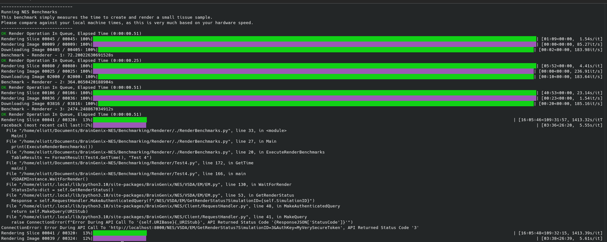

# Benchmarking Results
These are some of the results of the benchmark based on a test machine.  
The test machine has the following specs:  
 - CPU: 2x Intel Xeon E5-2697AV4
 - RAM: 256GB DDR4 2400Mhz ECC RDIMM
 - DISK: 1x 8TB Intel U.2 NVME SSD (PCIE Gen3x4)
 - GPU: 1X NVIDIA GEFORCE RTX 3080

Below is a table for the times of each test, and it's result.  

Best:

(2024-01-30)
|Test | Resulting Time|
|--------------|--------------|
|Test 0|1.5489952564239502|
|Test 1|1.4872243404388428|
|Test 2|3.3702552318573|
|Test 3|2.9481899738311768|
|Test 4|57.226759910583496|
|Test 5|40.67776370048523|
|Test 6|13.226645708084106|

(2024-01-30)
|Test | Resulting Time|
|--------------|--------------|
|Test 0|1.46994948387146|
|Test 1|1.387807846069336|
|Test 2|3.4752273559570312|
|Test 3|2.856602668762207|
|Test 4|57.484683990478516|
|Test 5|172.44664859771729|
|Test 6|6.462730407714844|

(2024-01-19)  
|Test | Resulting Time|
|--------------|--------------|
|Test 0|57.06065607070923|
|Test 1|3.269561767578125|
|Test 2|13.380038976669312|
|Test 3|25.894500970840454|
|Test 4|600.5755224227905|

(2024-01-18)  
|Test | Resulting Time|  
|--------------|--------------|  
|Test 0|537.0604424476624|  
|Test 1|42.07401394844055|  
|Test 2|165.1279900074005|  
|Test 3|383.94018626213074|  

Well, it never finished running since I had to move on, but the result is slow. I'll work on improving this during the week.

